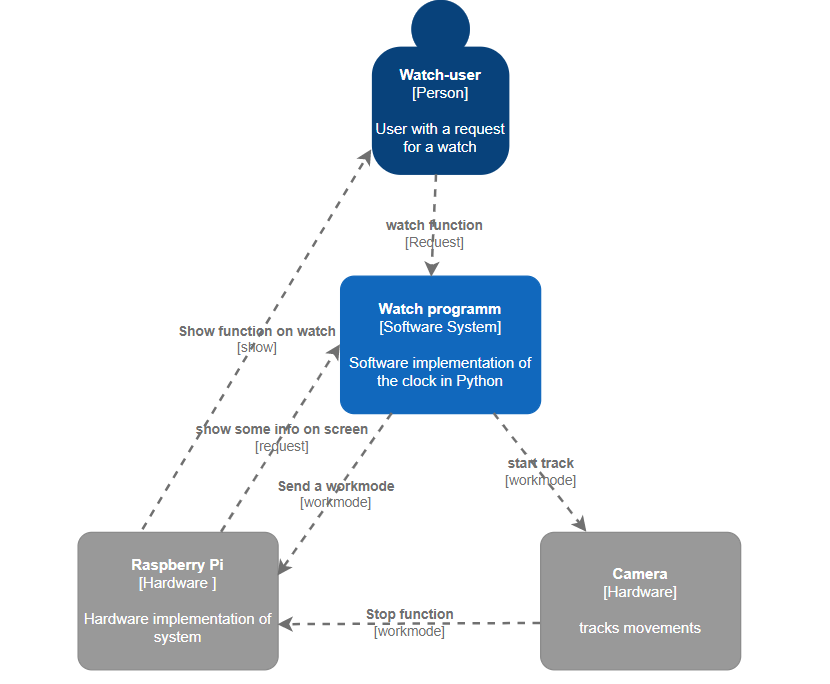
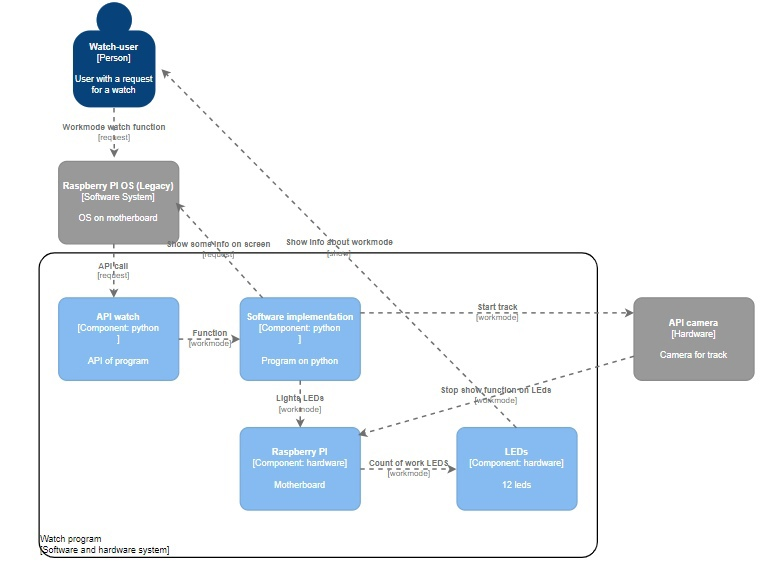

# Device simulating the operation of a watch with additional functions using Raspberry Pi 3B+
The project combines the hardware implementation of the device using the motherboard and external devices and the software implementation created for it in Python using libraries
threading, cv2, mediapipe

### Developers
- Alyona Bushkina
- Svaykin Ilya
- Stolbov Svyatoslav

### Project
As mentioned above, our project combines hardware implementation with software. 
For the hardware implementation, we chose the Raspberry Pi 3 Model B+ board, as the 
only one available to us. For the project to work, we also needed some external 
devices: a camera (Anti-glare Model: PK-635G), a keyboard, a monitor, and a mouse.

To assemble the clock itself, we used LEDs, resistors, Dupont cables, a breadboard 
and a soldering iron to connect all the parts. 
The connection diagram can be seen below:

Schematically, the LEDs are located on the breadboard as follows:

The interpretation of the clock will be a circle of 12 LEDs placed 
in a circle on the breadboard in accordance with the arrangement of 
numbers on a standard clock. A burning light means the number of hours 
(minutes), a flashing light means the number of minutes (seconds) 
depending on the selected operating mode of the unit. The operating 
mode of the system is selected dynamically while the program is running.

All work with external devices is done through the motherboard. 
The camera, keyboard and mouse are connected via USB, the monitor 
via HDMI using a VGA-HDMI adapter. LEDs connected via resistors use
GPIO pins to "communicate" with the motherboard.

### Program

Three threads initially work in parallel in the program. One is responsible for viewing the commands entered, the second for executing the previous command, the third for the camera, which constantly scans the space for the presence of a human hand.

During operation, the program can create more threads, for example, a new thread is created to count down the alarm clock.

Commands in the program:
- help - output of model functionality
- exit - termination of the program
- alarm - setting an alarm
- timer - setting the timer
- clock - time display
- sw - setting the stopwatch

### Block diagram
The first level describes the interaction between the user 
and the program. She, in turn, is already working with the 
hardware implementation and external devices.

At the second level, we described in more detail the interaction between software, 
hardware implementations and the user.

### Main libraries used
With the help of mediapipe and cv2 libraries, it is possible to stop functions using a hand movement.
- #### mediapipe
MediaPipe Hands is a highly accurate solution for tracking hands and fingers. It uses machine learning (ML) to deduce 21 three-dimensional hand landmarks from just one frame.

- #### cv2
OpenCV is a library for computer vision, used when reading images from a camera.

The time and datetime libraries implement working with time (read the current time, use the library functions to count seconds, return the date\time in the usual format, postpone the stream for a certain number of seconds, etc.)
- #### time and datetime
The time and datetime modules provide classes for processing time and date in different ways. The standard way of representing time is also supported, but more emphasis is placed on the ease of manipulating date, time and their parts.

Threading library for working with threads.
- #### threading
Threading is a standard module that comes with the interpreter. It was used to manipulate several threads and determine their behavior.

### Results
The finished model has the following functions:
- Watch
- Stopwatch
- Timer
- Alarm clock 

The operating mode is selected dynamically during the operation of the program, it is possible to stop the called signals using a hand movement recorded by the camera

